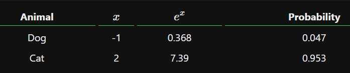
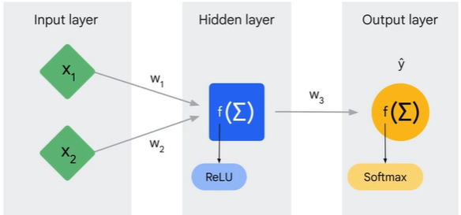

# Activation Function

An activation function has been used to prevent linearity or add non-linearity.

<figure><figcaption></figcaption></figure>

<figure><figcaption></figcaption></figure>

What does it mean? Think about a neural network. Without activation functions, the predicted result y hat will always be a linear function of the input x regardless of the number of layers between input and output. For example, the value of the hidden layer h equals to a total of w1 times x1 and w2 times x2. Please note that to make the illustration easy, we ignored the bias component b, which you often see in other ML materials. The output y hat therefore equals to w3 times h, and eventually equals to a total of constant number a times x1 and a constant number b times x2. Therefore, the output Y is a linear combination of the input X. If y is a linear function of x, you can save all the hidden layers and just leave one input and one output! Also, you might already know that linear models do not perform well when handling comprehensive problems.

That’s why you must use activation functions to convert a linear network to a non-linear one.

### Rectified Linear Unit (ReLU)

<figure><figcaption></figcaption></figure>

You can use the rectified linear unit (or ReLU) function, which turns an input value to zero if it’s negative, or keeps the original value if it’s positive.

<figure><figcaption></figcaption></figure>

### Sigmoid

<figure><figcaption></figcaption></figure>

Sigmoid function, which turns the input to a value between 0 and 1.

<figure><figcaption></figcaption></figure>

<figure><figcaption></figcaption></figure>

<figure><figcaption></figcaption></figure>

The sigmoid activation function essentially takes the weighted sum, w transpose x, plus b, from a linear regression, and instead of just outputting that and then calculating the mean squared error loss, we change the activation function from linear to sigmoid, which takes that as an argument and squashes it smoothly between zero and one. The input into the sigmoid, normally the output of linear regression, is called the logit. So we are performing a nonlinear transformation on our linear model.

Notice how the probability asymptotes to zero when the logits go to negative infinity and to one when the logits go to positive infinity.

What does this imply for training? Unlike mean squared error, the sigmoid never guesses 1.0 or 0.0 probability. This means that in gradient descent's constant drive to get the loss closer and closer to zero, it will drive the weights closer and closer to plus or minus infinity in the absence of regularization which can lead to problems. First, though, how can we interpret the output of a sigmoid?

<figure><figcaption></figcaption></figure>

Is it just some function that's range is zero to one, of which there are many, or is it something more? The good news is that it is something more. It is a calibrated probability estimate. Beyond just the range, the sigmoid function is the cumulative distribution function of the logistic probability distribution, whose quantile function is the inverse of the logic which models the long odds. Therefore, mathematically, the opposite of a sigmoid can be considered probabilities. In this way, we can think of calibration as the fact the outputs are real-world values like probabilities. This is in contrast to uncalibrated outputs, like an embedding vector, which is internally informative, but the values have no real correlation. Lots of output activation functions, in fact, an infinite number, could give you a number between zero and one, but only this sigmoid is proven to be a calibrated estimate of the training data set probability of occurrence. Using this fact about the sigmoid-activation function, we can cast binary-classification problems into probabilistic problems.

<figure><figcaption></figcaption></figure>

For instance, instead of a model just predicting a yes or a no, such as, "Will a customer buy an item?" it can now predict the probability that a customer buys an item. This paired with a threshold can provide a lot more predictive power than just a simple binary answer.

### Hyperbolic tangent (Tanh)

<figure><figcaption></figcaption></figure>

Hyperbolic tangent (Tanh) function, which shifts the sigmoid curve and generates a value between -1 and +1.

<figure><figcaption></figcaption></figure>

### Softmax

<figure><figcaption></figcaption></figure>

Think about sigmoid: it generates a value from zero to one and is used for binary classification in logistic regression models. An example for this would be deciding whether an email is spam. What if you have multiple categories, such as GitHub, NYTimes, and TechCrunch? Here you must use softmax, which is the activation function for multi-class classification. It maps each output to a \[0,1] range in a way that the total adds up to 1.

**Softmax turns arbitrary real values into probabilities**, which are often useful in Machine Learning. The math behind it is pretty simple: given some numbers,

1. Raise [e](https://en.wikipedia.org/wiki/E\_\(mathematical\_constant\)) (the mathematical constant) to the power of each of those numbers.
2. Sum up all the exponentials (powers of _e_). This result is the _denominator_.
3. Use each number’s exponential as its _numerator_.
4. Probability= $${Numerator}/{Denominator}$$

Written more fancily, Softmax performs the following transform on 𝑛_n_ numbers 𝑥1…_xn_:

<figure><figcaption></figcaption></figure>

<figure><figcaption></figcaption></figure>

The outputs of the Softmax transform are always in the range \[0,1]\[0,1] and add up to 1. Hence, they form a **probability distribution**.

#### **A Simple Example**

Say we have the numbers -1, 0, 3, and 5. First, we calculate the denominator:

Denominator= $$𝑒^{−1}+𝑒^0+𝑒^3+𝑒^5=169.87$$

Then, we can calculate the numerators and probabilities:

<figure><figcaption></figcaption></figure>

The bigger the 𝑥_x_, the higher its probability. Also, notice that the probabilities all add up to 1, as mentioned before.

#### **Implementing Softmax in Python**

Using [numpy](https://www.numpy.org/) makes this super easy:

```python
import numpy as np
def softmax(xs): return np.exp(xs) / sum(np.exp(xs))
xs = np.array([-1, 0, 3, 5])
print(softmax(xs)) 
# [0.0021657, 0.00588697, 0.11824302, 0.87370431]
```

[np.exp()](https://docs.scipy.org/doc/numpy/reference/generated/numpy.exp.html) raises e to the power of each element in the input array.

> Note: for more advanced users, you’ll probably want to implement this using the LogSumExp trick to avoid underflow/overflow problems.

#### **Why is Softmax useful?**

Imagine building a [Neural Network](https://victorzhou.com/blog/intro-to-neural-networks/) to answer the question: _Is this picture of a dog or a cat?_

A common design for this neural network would have it output 2 real numbers, one representing _dog_ and the other _cat_, and apply Softmax on these values. For example, let’s say the network outputs \[−1,2]\[−1,2]:

<figure><figcaption></figcaption></figure>

This means our network is **95.3% confident** that the picture is of a cat. Softmax lets us **answer classification questions with probabilities**, which are more useful than simpler answers (e.g. binary yes/no).

Therefore, the output of softmax is a probability distribution. Skipping the math, you can conclude that softmax is used for multi-class classification, whereas sigmoid is used for binary-class classification in logistic regression models.

<figure><figcaption></figcaption></figure>

Also note that you don’t need to have the same activation function across different layers. For instance, you can have ReLU for hidden layers and softmax for the output layer.
