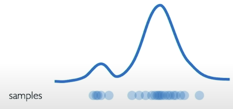

# BERT

BERT stands for Bidirectional Encoder Representations from Transformers, and it was developed by Google in 2018.

Today, BERT powers Google search. You can see how different the results provided by BERT are.

BERT was trained in two variations. One model contains BERT Base contains 12 stacks of transformers with approximately 110 million parameters and the other, BERT Large with 24 layers of transformers with about 340 million parameters. The BERT model is powerful because it’s able to handle long input context. It was trained on the entire Wikipedia corpus and the BookCorpus. The BERT model was trained for one million steps BERT is trained on two different tasks which means it has a multi-task objective. This makes BERT very powerful. BERT is a large model and was trained on the TPU for four days. Because of the kind of tasks it was trained on, it works both at a sentence level and at token level.

Both BERT base and BERT large have many encoder layers: 12 for the base version, and 24 for the large version.

<figure><figcaption></figcaption></figure>

BERT was trained on two different tasks.

<figure><figcaption></figcaption></figure>

<figure><figcaption></figcaption></figure>

This image below shows how tokens are fed into the model.

The first input token is a special token \[CLS]. CLS stands for classification, which is the task or objective of this model training. From the input sentence, you get three different embeddings: token, segment, and position embeddings.

<figure><figcaption></figcaption></figure>

the role of the token embedding layer is to transform words into vector representations of certain dimensions.

In BERT, each word is represented by a 768-dimensional vector.

<figure><figcaption></figcaption></figure>

BERT can solve NLP tasks that involve text classification. An example is to classify whether two sentences, say my dog is cute and he likes playing, are semantically similar.

The pairs of input texts are simply concatenated and fed into the model. How does BERT distinguish the inputs in a given pair? The answer is segment embeddings, which decide the special token \[SEP], a separator to split different sentences.

Another problem is to learn the order of the words in a sentence. As you know, BERT consists of a stack of Transformers. Broadly speaking, Transformers do not encode the sequential nature of the inputs. BERT is designed to process input sequences of up to length 512. The order of the input sequences is incorporated into position embeddings, which allow BERT to learn a vector representation for each position.

Nowadays, BERT is not trained from scratch. Instead you fine-tune a pre-trained BERT model for a downstream task. With this approach, the model performs better and quicker, especially in some niche tasks.&#x20;

To fine-tune BERT, you must make three additions.&#x20;

First, you must represent the input sentence as a single-packed sequence. Depending on the task, you may have slightly different ways to make the sequence such as for classification, or for similarity.

<figure><figcaption></figcaption></figure>

Second, you must add a new output layer to the pre-trained model.

<figure><figcaption></figcaption></figure>

And third, based on the amount of input data, you can choose to either fine-tune the model parameters or leave them as they are.

<figure><figcaption></figcaption></figure>

You can use BERT for various downstream tasks for example, single sentence classification, sentence pair classification, question answering, and single sentence tagging tasks and many more.

<figure><figcaption></figcaption></figure>
