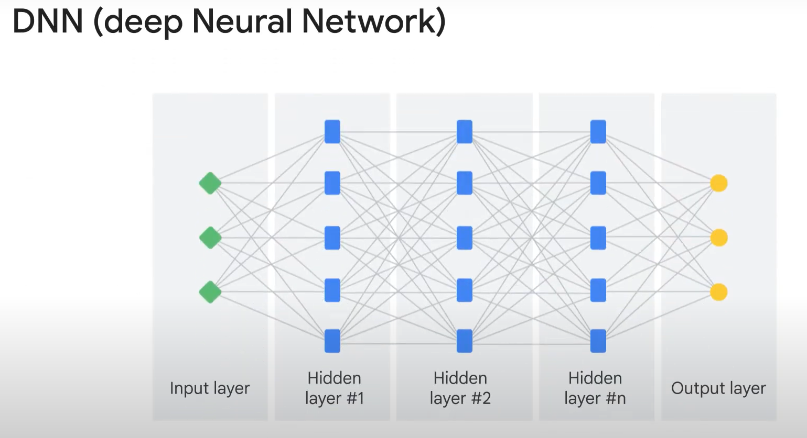

# Deep Neural Network (DNN)

<figure><figcaption></figcaption></figure>

The only difference between ANN and DNN is that the later has more hidden layers, whihc allows a neural network to learn deeply.

The sequential model is the simplest type, and it groups a linear stack of layers into a tf.keras. Model. A sequential model is a simple list of layers that are connected so that the output of one layer is the input of the next. A DNN model is a typical example of a sequence model. To use the sequential Keras model, you must follow several steps: First, define and create the model.

<figure><figcaption></figcaption></figure>

The purpose of the code is to build a DNN model as suggested by the function name. Please note that the code might change along with the advancement of TensorFlow. The parameter that you will pass to the function is to define the <mark style="color:purple;">dimension of the word embedding</mark>. If you recall from the last module, this value is a hyperparameter that you set before model training. Then you start building the sequential model. The first step is to prepare the input layer. The preprocessing layer has been defined earlier in the coding by using a new API called TextVectorization. Here you specify the maximum length of the sequence output as 26, and the maximum number of tokens as 20,000. Then you pass the parameters to the TextVectorization API. This preprocessing is to prepare the input layer. The second step is word embedding. You embed the input layer and convert input vectors (such as sparse one-hot encoder vectors) to dense vectors. In this step, you must tell TensorFlow what the embedding vectors look like by specifying the parameters. Vocabulary size equals to the actual size (vocab\_size) plus one. Earlier in the coding, you set the vocab\_size to the number of tokens in the dataset. Sometimes, during prediction, the model might encounter words that it didn't learn during training. To account for these unknown words, you add one to the VOCAB\_SIZE argument. Max\_len calculates the maximum number of words of an article title in the dataset. For the embedded vectors, that defines the shape (the length) of a vector. This step is called word embedding. The third step is to create a hidden layer. In the code, you use a lambda layer to calculate the average of the embedded vectors and use it to represent a sentence. Please note that this representation does not consider the order of words. It’s a pure "bag” (or a collection) of words representation. Now you obtain the hidden layer by using a simple lambda function to calculate the mean of the vectors. This last step is to generate the output layer by using a softmax function. Remember that softmax is an activation function that converts the input to probability distributions. The softmax function can be used to solve the text classification problem in the lab where you must predict the article source including: GitHub, NYTimes, and TechCrunch. Now that you created the model, the next step is to compile the model to configure it for training. In this step, you specify the optimizer, loss function, and evaluation metrics. Cross-entropy has been used here as the loss function to solve the multi-class classification problems. After model compiling, you can start model training.&#x20;

<figure><figcaption></figcaption></figure>

Call model.fit() with the training dataset to train the model for a number of epochs (iterations). You first set up all the hyperparameters such as epochs, embed dimension, and patience. Epochs are the number of iterations you want the model to train. Embed dimension (EMBED\_DIM) decides the number of features to represent a word. You explored word embeddings and the embed dimension in the last module on text representation. Patience specifies the number of iterations (epochs) with no improvement after which training will be stopped. Remember that in the previous lesson, we talked about ANNs and backpropagation. You were asked how to know if the value of the cost function reaches the bottom so that you can stop the model training. Patience is the parameter that helps you make this decision. For example, after five epochs, if the value of the cost function doesn't go down anymore, it’s time to stop training. You then create a model object and start training (or fit) the model. The next step after you train the model is to evaluate its performance by plotting the history of the loss and the performance metrics. These two lines of code plot the loss function and the model evaluation metric to give you a visual illustration of the model performance. An optional step is to print a string summary of the network. You can use the model.summary() function to print out the architecture of this model and the number of parameters associated with it. You can also use the utils function of Keras to convert a Keras model to dot format and save it to a file. After model training and evaluation, now it’s time for prediction.&#x20;

<figure><figcaption></figcaption></figure>

You can define a prediction function. You use model.predict() and pass the text (for example, the article titles) that you want to classify. model.predict() returns the predictions in the form of probabilities for each class. The code below this line is to format the output. And then call the prediction function whenever needed. That’s it! In addition to the specific case to train a DNN model, this coding also shows you the general process on how to: Create an ML model where you can prepare an input layer, create hidden layers, and specify an output layer. Train an ML model. Evaluate an ML model. And make predictions.
